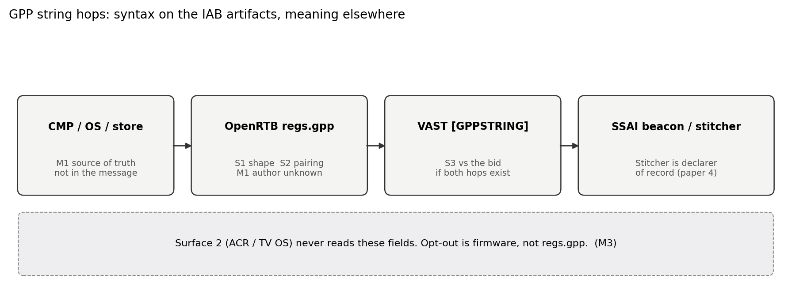
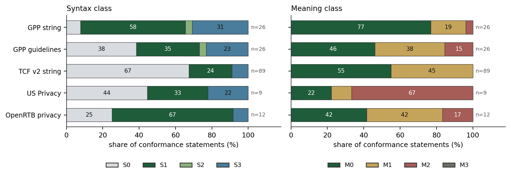
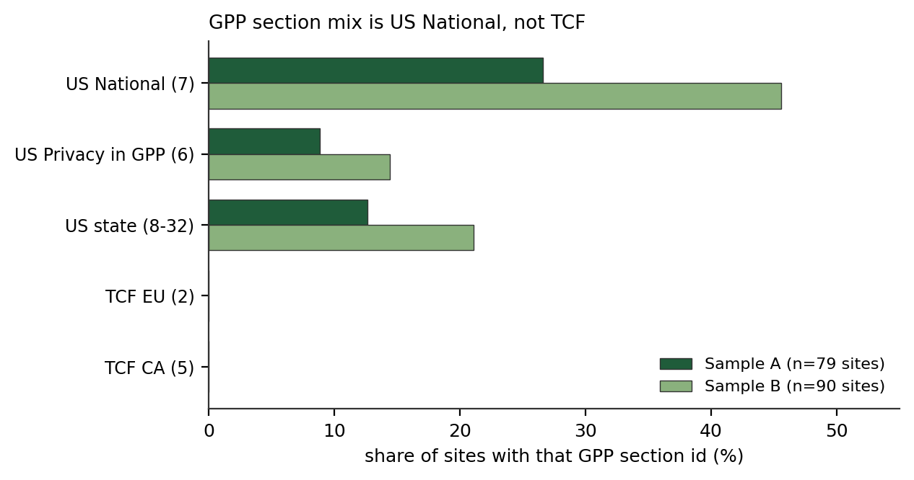

# How Machine-Checkable Is IAB Privacy Signaling? Syntax versus Meaning on the Wire

**Aleksander Sekowski**

Independent researcher

Preprint, August 2026, version 1.0. ResearchGate publication 413765958. Paper 5 of the checkability series, after *VAST XML Validation at Bid-Time Scale* (doi:10.13140/RG.2.2.11404.27520), *How Machine-Checkable Is OpenRTB?* (doi:10.13140/RG.2.2.27937.57448), *Measuring OpenRTB Dialects in Client-Side Header Bidding* (doi:10.13140/RG.2.2.26572.78720), and *Why CTV Ad Fraud Keeps Working* (ResearchGate 413532379).

Keywords: Global Privacy Platform, Transparency and Consent Framework, OpenRTB, connected TV, privacy signaling, protocol verification, server-side ad insertion.

Every count in this paper is produced by a script in the accompanying artifacts. Specification quotes are taken from pinned GitHub commits and a SHA-256 of OpenRTB 2.6-202606. Artifacts: github.com/aleksUIX/iab-privacy-checkability.

---

## Abstract

IAB Tech Lab's privacy stack (GPP, TCF, US Privacy, OpenRTB `regs` / `user` / `device`, and VAST privacy macros) is built to carry consumer choice across the bid. This paper asks how much of that stack a receiver can check, and what a check decides. IAB privacy signaling is a transport: the checkable layer is string shape, not a person-fact.

We extract 221 normative-keyword sentences from pinned GPP, TCF, US Privacy, and OpenRTB 2.6-202606 privacy texts. After screening out 59 non-conformance sentences, 162 statements remain. Each is coded for syntax, meaning, and the enforceability classes of *How Machine-Checkable Is OpenRTB?*. Reliability is a delayed same-author recode, not independent double-coding. On the GPP string spec, US Privacy, and OpenRTB privacy fields the recode matches syntax on 19 of 19 sampled rows. Six of eight disagreements are TCF process sentences.

Of 26 GPP-string conformance statements, 16 (61.5%) are S1 or S2 and 20 (76.9%) are M0. The TCF document is the opposite mix: 60 of 89 conformance statements (67.4%) are S0.

Web header-bidding traffic from the companion measurement paper is the control, not an EEA consent study: 20,226 requests, 165 sites, one US vantage. GPP is the MSPA US National section, never TCF Europe. On Sample A, 40 of 79 sites carry GPP, 29 of 79 still send deprecated US Privacy under `regs.ext`, and 38 of 79 still send leftover `regs.ext.gdpr`. Media.net is 26 sites and zero of these fields. Connected TV is the stress test for meaning: the CMP GPP assumes is often missing, server-side ad insertion makes the stitcher the declarer of record, and ACR never reads those fields.

A receiver can reject a malformed GPP header or a missing `gpp_sid`, and can warn on leftover `regs.ext.gdpr`. That is not consent, not COPPA, and not a bound on ACR.

---

## 1. Introduction

GPP exists so one string can carry TCF Europe, TCF Canada, the MSPA US national section, and US state sections through OpenRTB. OpenRTB 2.6 promoted `regs.gdpr` and `user.consent` out of `ext`, then added `regs.gpp` and `regs.gpp_sid`. VAST lists macros for the same bytes: `[GDPRCONSENT]`, and on the current macros page `[GPPSTRING]` and `[GPPSECTIONID]`. The industry talks as if putting the string on the wire were the compliance event.

Paper 2 showed that a large share of OpenRTB is not machine-decidable [13]. Paper 4 showed that CTV delivery claims are self-declared behind server-side ad insertion [26]. The remaining question is the privacy subset. Even the parts that *are* machine-decidable may only be decidable as strings.

That distinction is the contribution. A GPP header that starts with `DB`, splits on `~`, and whose section count matches `gpp_sid` is S1 and S2. The same string does not tell a receiver that a CMP wrote it, that a household opted out, that LAT was on, or that the inventory is not directed at children. Those facts, when they exist, sit in a CMP, an OS, a store rating, or a publisher assertion. On connected TV they often sit in the stitcher. Next to that path, automatic content recognition fingerprints the panel without consulting `regs.gpp` at all [8].

Web header bidding is the control condition because a CMP can be in the page. Paper 3's Sample A, a random draw of Tranco sites that run client-side header bidding, captured from one US residential vantage, already showed leftover `regs.ext.gdpr` after 2.6 moved the field [25]. We recompute that leftover from the frozen issue table (38 of 79 sites) and retabulate stored request bodies for GPP, US Privacy, COPPA, and consent placement. The vantage is US; the harness accepts a recognised CMP grant. The measurement is therefore a test of plumbing, not of opt-out honoring.

We make five contributions.

1. **A syntax/meaning codebook for IAB privacy artifacts**, orthogonal to paper 2's A/B/C/D. Syntax asks whether a receiver can reject the bytes. Meaning asks whether a pass decides anything about a person.
2. **A statement dataset.** 221 keyword sentences from pinned GPP, TCF, US Privacy, and OpenRTB privacy texts; 162 conformance statements; coded on all three axes.
3. **A CTV reading without a new living-room lab.** Who can author `regs.*` when a CMP is often missing; SSAI as declarer of record; VAST macros as S3; ACR as Surface 2. Section 5 applies paper 4 and Anselmi. It does not add a CTV bid stream.
4. **A web baseline from paper 3's six captures.** 20,226 request payloads, 165 sites. Leftover `ext` placements, GPP section mix (US National, not TCF), deprecated US Privacy still on the wire, `coppa` used only as 0. US vantage, labeled as such.
5. **Open artifacts.** Extraction and coding scripts, the labeled CSV, wild aggregates with no payload values, and the existing GPP/TCF decoders in RTBlint and pixellint as the syntax instrument.

Non-claim: we do not measure whether anyone's GDPR or CPRA program is lawful. We do not estimate the prevalence of consent in the EEA. We do not claim that a linter is a compliance program.

---

## 2. Background and related work

### 2.1 The IAB privacy portfolio

IAB Tech Lab's public name for the stack is Global Privacy Platform. The string specification titles itself Global Privacy Protocol [1]. We use Platform for the stack and Protocol where we cite that document title. A GPP string is a type-3 header, currently version 1, followed by `~`-separated section payloads. Section identifiers are listed in the GPP Section Information file. OpenRTB carries the string in `regs.gpp` and the in-force section ids in `regs.gpp_sid` [2]. The implementation guidelines, extracted here from the GPP repository at commit `03fdf03` (6 August 2026), tell publishers, CMPs, and vendors where to find the string: CMP API on the page, `Regs` in OpenRTB, URL macros when JavaScript cannot run [3].

IAB Tech Lab's August 2026 public comment (GitHub PR 160, window through 11 September 2026) proposes GPP updates for the Fifth Amended and Restated Multi-State Privacy Agreement [4, 5]. The comment would simplify the US National section and freeze MSPA-related fields on state sections. This paper pins the pre-comment commit and treats the pull request as a moving target, not as the specification.

IAB Europe's Transparency and Consent Framework encodes purposes, vendor consents, legitimate-interest transparency, and publisher restrictions in a TC string that only a registered CMP is supposed to create [6]. OpenRTB carries it in `user.consent`, with `regs.gdpr` as the 0/1/omitted applicability flag. The TCF document we extract is the string and Global Vendor List format (final v2.2, May 2023), not the CMP JavaScript API and not the Policies.

The US Privacy string is four characters: a version digit and three `Y`/`N`/`-` flags for notice, opt-out of sale, and LSPA coverage [7]. IAB Tech Lab deprecated it on 31 January 2024 in favor of GPP. It remains in the OpenRTB 2.6 tables as `regs.us_privacy`, and it remains in live traffic (Section 6).

`regs.coppa` is a 0/1 for whether the sender asserts that COPPA applies [2]. `device.dnt` and `device.lmt` are 0/1 flags whose specified source is a browser header and a commercially endorsed Limit Ad Tracking signal. `device.ifa` is an unhashed advertising identifier the spec says should come from an OS advertising API unless buyer and seller have arranged otherwise. `user.eids` carries third-party identifiers; `inserter` is supposed to match ads.txt.

VAST 4.x macros, maintained on a page that can add tokens without a VAST version bump [9], include `[IFA]`, `[IFATYPE]`, `[LIMITADTRACKING]`, `[REGULATIONS]`, `[GDPRCONSENT]`, `[GPPSTRING]`, and `[GPPSECTIONID]`. Paper 1 treated VAST as a bid-time XML validation problem [24]; the macros here are the privacy subset of that payload. IAB Tech Lab's SSAI VAST macro guidance (November 2020) defines `[SERVERSIDE]` so a receiver can distinguish client-initiated from server-fired tracking [10]. Those macros forward bytes. They do not create a CMP. The Digital Services Act transparency extension is an EU platform duty. It is not in this extract.

### 2.2 How the string is supposed to be born

On the web, a CMP writes a TCF or GPP string through the CMP API; the page passes it into Prebid or another header-bidding library; adapters copy it into OpenRTB. Paper 3's harness already clicks a recognised consent button where one exists [25]. In apps, a CMP SDK plays the same role. On connected TV the usual author is missing. Manufacturer privacy rows, publisher ad-server defaults, and SSAI servers can all populate `regs.*` and `device.ifa`. Paper 4 called the stitcher the declarer of record for delivery claims [26]. The same hop authors the privacy fields.

### 2.3 Related work

Smart-TV measurement has documented tracking that does not travel on IAB strings. Moghaddam et al. watched viewing on consumer televisions (CCS 2019) [11]. Varmarken et al. showed that smart TVs are full of trackers (PoPETs 2020) [12]. Tagliaro et al. recovered viewing from subsequent traffic (NDSS 2023) [14]. Anselmi et al. audited automatic content recognition on living-room devices and found linear and HDMI sources dominating the ACR surface (IMC 2024) [8]. Paper 4 cited Anselmi as a second pipe next to the ad-funded stream. This paper takes that pipe as Surface 2 and does not repeat the living-room audit.

CMP and consent-UI measurement is the web control. Nouwens et al. documented dark patterns in cookie banners after GDPR (CHI 2020) [20]. Matte, Bielova, and Santos asked whether those banners respect the recorded choice (PETS 2020) [21]. Later work on revocation and on being tracked after opt-out [15, 16] shows that even when a CMP is in the page, the person-fact can fail. That literature is M1 going wrong: the named source of truth is present and still does not bind the downstream pipe. We cite it as the reason CTV is a stress test rather than a second CMP paper. On CTV the named source is often missing. On the web it is present and still not sufficient. Neither result is a lawful-basis audit of any named company.

ICCL and related civil-society reports treat bid-stream identifiers as personal data [22]. Adjacent, and not this paper's policy ask. We ask whether the IAB wire contract is a predicate a machine can reject. AdCP's `consent_basis` enumeration is the same split on an agentic path: a receiver can reject an unknown token and cannot test whether the basis is true of a person [23].

Paper 2 classified OpenRTB's normative sentences into schema, lint, runtime, and undecidable [13]. Paper 3 measured client-side OpenRTB dialects, including leftover GDPR-path placements [25]. Paper 4 defined a Verifiability Index on delivery claims and found that 91.5% of pricing-relevant claims on a CTV SSAI impression are self-declared [26]. None of those papers extracted the privacy subset or split syntax from meaning. Plenty of CMP UI papers exist, and plenty of smart-TV traffic papers. To our knowledge there is no prior statement-level checkability profile of GPP, TCF, US Privacy, and OpenRTB privacy fields. The gap is the IAB wire contract: which sentences a receiver can check, and what those checks decide about a person.

---

## 3. Method

### 3.1 Corpus

We analyze five texts, all pinned before extraction (PINS.json):

- GPP Consent String Specification, InteractiveAdvertisingBureau/Global-Privacy-Platform commit `03fdf0332d261ee896b77d7f9a10edde1498fc7c` (6 August 2026). Extraction starts at "About the Global Privacy Protocol String."
- GPP implementation guidelines, same commit, `implementation.md`. Extraction starts at section 1. US-state GPP section specs and the CMP JavaScript API are excluded from the headline count. They would multiply S1 bit-field rows without changing the meaning profile.
- TCF v2 consent string and vendor list formats, InteractiveAdvertisingBureau/GDPR-Transparency-and-Consent-Framework commit `703fc2964ba8fe1086b18a3c509c46a48c1aee1c` (28 July 2026). Extraction starts at Introduction. The CMP API specification is excluded.
- US Privacy String, InteractiveAdvertisingBureau/USPrivacy commit `7a281d542347246a168291a3af2979551ee340db` (8 July 2025). Extraction starts at Introduction. The deprecation banner itself contains no keyword we extract; deprecation is coded where the GPP guidelines say the US Privacy section should not be used, and is treated as a finding in Section 4 and Section 6.
- OpenRTB 2.6-202606 privacy excerpt: sections 2.7, 3.2.3 Regs, privacy-relevant Device and User rows (`dnt`, `lmt`, `ifa`, `consent`, `eids`), EID and UID, and the cookie-sync privacy close of Appendix C. SHA-256 of the source markdown: `1b730796e2776d576cb5749706f6638fd4aa35594c1182e7d0e6aedbce605728`. Same file as paper 2.

VAST privacy macros are confirmed from the official macros page and the local `macros-data.json` [9]. They are Table 3 companions, not a sixth sentence corpus: most macro rows have no normative keyword.

The August 2026 MSPA public comment (GitHub PR 160, comment window 11 August to 11 September 2026) is dated, not extracted [5].

### 3.2 Statement extraction

The extractor is the paper 2 pipeline, restricted to these files [13]. Prose and field-description cells are split into sentences. A sentence is retained if it contains a case-insensitive normative marker: must, must not, shall, should, should not, may, required, recommended, optional, cannot, prohibited, not permitted, not allowed, expected to. Front matter, licenses, tables of contents, version histories, and About-IAB-Tech-Lab boilerplate are skipped. The GPP string extract starts at the heading About the Global Privacy Protocol String, which is not that boilerplate. Identical (spec, text) pairs are dropped once. This yields 221 keyword sentences: GPP string 45, GPP guidelines 45, TCF 106, US Privacy 10, OpenRTB privacy 15. Case-folded and whitespace-normalised, that is 217 unique texts. One GPP header sentence is repeated with a capital H (ids 5 and 7). Three URL-macro sentences appear in both the GPP string spec and the TCF document; the drop rule is (spec, text), so those cross-spec repeats stay. Obligation strength (obligation / recommendation / permission) is tagged by the strongest marker, as in paper 2. One TCF dump concatenates two sentences across a leftover setext underline (`=======`). The extractor treats underline-only lines as paragraph breaks, so those two sentences are counted separately.

CMP JavaScript APIs and per-state GPP section specifications are a method note, not a hidden denominator. Including them would inflate S1 (every state section repeats version bits) and would not add person-facts. Section 6 still reports which section ids appear on the wire, including California (id 8); those counts are traffic, not extra rows in Table 1.

### 3.3 Codebook

Each keyword sentence is screened and labeled by the author. Sentences that state no conformance constraint (definitions, worked examples, changelog, org boilerplate) are paper-2 class X and are excluded from enforceability denominators; 59 of 221 fall there. The remaining 162 receive exactly one syntax class, one meaning class, and one paper-2 class.

**Syntax** (can a receiver reject the bytes):

- **S0.** Not a wire artifact. Implementation-guide prose about org process, contracts, UI, or GVL caching.
- **S1.** Shape. Alphabet, version bits, length, enum, 0/1, presence of a paired field.
- **S2.** Internal consistency of the artifact. Header section count versus payloads after `~`; TCF version bits versus declared TCF; `gpp_sid` versus encoded section ids.
- **S3.** Cross-artifact syntax. String in the bid versus string in a VAST macro versus string on an SSAI beacon. Checkable if the receiver has both hops. Paper 2 class C.

**Meaning** (does a pass imply the legal or user fact):

- **M0.** No person-fact. Pure transport ("carry the string if present").
- **M1.** Meaning is delegated to a named source of truth that is not in the message. A CMP wrote the TC string; the OS set LAT; a store age-rating marked the app.
- **M2.** Meaning is the sender's word. `regs.coppa=1` means the sender asserts COPPA. No public registry rejects a lie. Same structure as paper 4 class C (self-declared).
- **M3.** Meaning is outside this contract. ACR fingerprints, HbbTV pixels, vendor CAPI on a different pipe. An IAB-valid bid is silent. Surface 2 is a boundary row, not an extracted IAB sentence, which is why the corpus M3 count is zero by construction.

**Paper 2 class** A / B / C / D as in *How Machine-Checkable Is OpenRTB?*, applied only to this subset. Expected pattern: A/B on S1, D or C on M1/M2.

Coding rules that matter for replication: code the spec's own claim, not the press-release claim. Deprecated artifacts stay in the corpus. `regs.coppa` is S1+M2; we do not invent a kids-app registry. `device.ifa` presence is S1; OS origin and SSAI substitution are M1/M2. VAST `[GPPSTRING]` is S3 relative to `regs.gpp`. Vendor hash contracts are a contrast table, not a second dataset.

### 3.4 Reliability

A random sample of 40 of the 221 keyword sentences (seed 20260822, published), including class X, was recoded from the codebook and the statement text, without the first-pass labels in view. Agreement with the author's labels is 90.0% syntax (Cohen's kappa 0.83), 90.0% meaning (kappa 0.80), and 85.0% paper 2 (kappa 0.81). Full triple match is 32 of 40. Those kappas sit in Landis and Koch's substantial to almost-perfect band [19]; we do not treat the scale as independent corroboration. This is a delayed same-author recode, not independent human double-coding, and we disclose it as such. The eight disagreements are: the M1 versus M2 reading of "in force" on `gpp_sid`; one document-scope sentence coded X on recode; whether v1/v2 coexistence is S2; whether a 2-bit publisher-restriction enum is shape or policy; two GVL-version UI duties coded X on recode; whether TCF policy-version comparison is S3; and whether an EID permission is X. Adopting all eight recode labels moves n from 162 to 158, S1+S2 from 35.8% to 37.3%, and the green cell from 24.7% to 25.3%. The recode is not uniform across specs. On the 19 sampled rows from the GPP string spec, US Privacy, and OpenRTB privacy fields, syntax matches 19 of 19 and meaning matches 18 of 19 (the `gpp_sid` in-force row). Six of eight disagreements are TCF process or UI-resurface sentences. Syntax kappa on that TCF subsample (n=16) is 0.47. Dropping the capitalised header twin (n=39) leaves overall syntax kappa at 0.82. The 0.83 headline is not an artefact of that twin. It is an artefact of pooling a stable wire codebook with unstable TCF process prose. The keyword heuristic in `code.py` is a seed, not a second coder. It matches author syntax on 126 of 162 conformance rows (77.8%) and the full triple on 93 (57.4%). Table 1 is the author labels.

### 3.5 Web baseline

Paper 3's Sample A is a random draw of Tranco top-50k sites that run client-side header bidding, captured from one US residential vantage with Playwright [25]. Sample B is 123 purposive publishers, 90 of which yield request-side sites at first contact, used for endpoint depth, not prevalence. The published issue table (`dataset_sampleA/issues.csv`) has 79 request-side sites. We recompute leftover-path site counts from that frozen table so the 38-of-79 `regs.ext.gdpr` figure is not retyped.

We then walk stored request bodies in all six paper 3 captures: three Sample A waves (wave 1, weekday wave 3, tranco-deep first contact) and three Sample B waves (`full1`, wave 2, wave 4). That is 20,226 OpenRTB requests and 165 distinct site identifiers (80 Sample A, 90 Sample B, 5 in both). Prevalence claims use Sample A wave 3 (3,057 requests, 79 sites), matching the rest of Section 6's site denominator. The other waves are a stability check. Sample B is confirmatory.

For each request we record first-class versus `ext` placement of `gpp`, `gpp_sid`, `gdpr`, `us_privacy`, `coppa`, `user.consent`, `dnt`, `lmt`, and `ifa`; 0 versus 1 on `coppa` and `gdpr`; the four-character US Privacy alphabet when the string matches `1[YN-]{3}`; coexistence of GPP with leftover USP and `ext.gdpr`; and GPP section IDs. Section IDs are taken from `gpp_sid` when present, otherwise decoded from the GPP header with the same type-3 version-1 Fibonacci range as RTBlint. The string is discarded. A header/`gpp_sid` disagreement is counted as S2. No consent strings, IFAs, user ids, or page URLs are stored in the released aggregates. The harness accepts a CMP grant where a known button exists. This is fatal for "opt-out honored" and acceptable for syntax and codec mix.

### 3.6 The validator instrument

RTBlint already decodes GPP headers (type 3, version 1, section-count versus payloads, `gpp_sid` pairing, reserved sid 3) and TCF core-string shape. pixellint already flags TCF `gdpr`/`gdpr_consent` coherence, US Privacy format and deprecation, and GPP `gpp`/`gpp_sid` on pixel URLs. Those tools certify that S1 and S2 are non-empty in practice. They are instruments, not the contribution.

### 3.7 Threats to validity

Single coder, mitigated by a published delayed recode and a row-level CSV. GPP in public comment during August to September 2026; we pin the pre-comment commit. Paper 3 is not EEA. No CTV bid-stream vantage (same as paper 4). No ACR replication. Keyword extraction misses table cells that encode type without a normative verb; OpenRTB `coppa` and `gdpr` rows are in that hole, which is why Table 3 is a field coding, not a sentence count.

---

## 4. How checkable is the IAB privacy stack

Table 1 and Figure 2 give the distribution over 162 conformance statements. Figure 1 is the hop reading that Table 1 has to support: syntax attaches to the IAB artifacts; meaning stays at the CMP, the OS, or the stitcher; ACR never enters.

**Table 1.** Conformance statements by specification. M3 is 0 in every row.

| Spec | Keyword | X | n | S0 | S1 | S2 | S3 | M0 | M1 | M2 | M3 |
| --- | ---: | ---: | ---: | ---: | ---: | ---: | ---: | ---: | ---: | ---: | ---: |
| GPP string | 45 | 19 | 26 | 2 | 15 | 1 | 8 | 20 | 5 | 1 | 0 |
| GPP guidelines | 45 | 19 | 26 | 10 | 9 | 1 | 6 | 12 | 10 | 4 | 0 |
| TCF v2 string | 106 | 17 | 89 | 60 | 21 | 0 | 8 | 49 | 40 | 0 | 0 |
| US Privacy | 10 | 1 | 9 | 4 | 3 | 0 | 2 | 2 | 1 | 6 | 0 |
| OpenRTB privacy | 15 | 3 | 12 | 3 | 8 | 0 | 1 | 5 | 5 | 2 | 0 |
| **Total** | **221** | **59** | **162** | **79** | **56** | **2** | **25** | **88** | **61** | **13** | **0** |
| Share of n | | | 100% | 48.8% | 34.6% | 1.2% | 15.4% | 54.3% | 37.7% | 8.0% | 0% |

M3 is empty because Surface 2 is not an IAB sentence.

### 4.1 Worked rows

Four statements show how the three axes pull apart.

GPP string, S1+M0+A: "The string must contain a header and applicable discrete section(s): [Header]~[Discrete Section]." A decoder rejects a missing `~`. Nothing about a person has been decided.

GPP string, S0+M1+D: "Vendors or any other third-party service providers must neither create nor alter GPP Strings." That is the meaning of the framework. A receiver of `regs.gpp` cannot test it. SSAI that originates the string (Section 5.2) is exactly this failure.

GPP string, S1+M2+D: `gpp_sid` "indicates to the callee which section of the string is considered in force by the caller." The array is typed (S1). In-force is the caller's word (M2). A delayed recode read this as M1 (CMP/geo as the hidden source). Either reading, a pass on the integers is not a pass on jurisdiction.

OpenRTB, S1+M2+A: `regs.coppa` is 0 or 1. Paper 2 class A. Paper 4 class C on CTV SSAI. The boolean is checkable. The children's-inventory fact is not. Table 3 exists because this row barely produces a keyword sentence; the object table states the flag without "must."

### 4.2 Syntax is dense on the string, thin on the portfolio

The GPP string specification is a grammar. 16 of its 26 conformance statements (61.5%) are S1 or S2: header required and first, `[Header]~[section]` layout, section-id order matching payload order, Fibonacci range encoding, URL-macro alphabet. Eight more (30.8%) are S3, mostly URL-macro forwarding when the caller cannot use the CMP API (`${GPP_STRING}` / `${GPP_SID}`). Only two conformance statements are S0 (vendors must not create the string; vendors should read framework policy). 20 of 26 (76.9%) are M0. That is the stack the industry means when it says GPP is machine-readable.

The TCF document, extracted as IAB publishes it, is not that grammar. 60 of 89 conformance statements (67.4%) are S0: GVL fetch and cache-control, CMP-list caching, Planet49 storage disclosures, Policies about legal bases, "only a registered CMP may create a TC string." Those last sentences are the meaning of the framework and they are not on the wire. The format tables that a decoder uses are the 21 S1 rows: core string required first, disclosed-vendors segment mandatory in 2.3, `IsServiceSpecific` fixed to 1, PurposesLITransparency bits 2 to 5 zero, `NumPubRestrictions` present even if zero. S2 inside TCF prose is empty in this extraction. Internal consistency lives in the bit layout, which RTBlint checks and which the keyword extractor under-counts when a table cell has no "must."

US Privacy is small and honest. Three S1 statements constrain the four-character alphabet, including the rule that position three (opt-out of sale) cannot be `-` when CCPA applies. Six of nine conformance statements are M2: the digital property determines jurisdiction and is expected to send the string. The spec does not name a CMP.

OpenRTB privacy fields are mostly S1 flags and strings (`dnt`, `lmt`, `gpp_sid` cardinality) whose meaning is M1 or M2. `device.ifa` is S1 as a presence/shape check and paper-2 D as an origin claim: the spec itself allows a bilateral exception to the OS-API rule, and paper 4 showed SSAI can originate the value.

GPP guidelines sit in the middle. Header-required and US-Privacy-deprecated are S1. "Read the string from `Regs`" and "send according to OpenRTB" are S3. "Start with legal counsel" is X. The string specification's About section says GPP streamlines transmitting privacy signals. That sentence has no normative keyword, so it is not a Table 1 row. Read as a claim, it is S1+M1: a transport, not a GDPR predicate.

On the full 162, S1+S2 is 35.8%. That is the headline share. A secondary wire cut (n=121) keeps the string specs, OpenRTB privacy, TCF minus GVL/GCL/Planet49, and GPP-guidelines rows only when they were already coded S1, S2, or S3. Guidelines inclusion is therefore label-dependent; 47.1% is not a pre-specified document cut. Either denominator: the checkable layer is the grammar, and a large share of the privacy portfolio is process a bid receiver cannot see.

**Table 2.** Leave-one-specification-out on the 162 conformance statements. Scripted in `finalize.py`.

| Cut | n | S1+S2 | M0 | Green (S1 or S2, and M0) |
| --- | ---: | ---: | ---: | ---: |
| Full portfolio | 162 | 35.8% | 54.3% | 24.7% |
| Drop TCF v2 string | 73 | 50.7% | 53.4% | 32.9% |
| Drop GPP string spec | 136 | 30.9% | 50.0% | 19.1% |
| Drop GPP guidelines | 136 | 35.3% | 55.9% | 24.3% |
| Drop OpenRTB privacy | 150 | 33.3% | 55.3% | 24.7% |
| Drop US Privacy | 153 | 35.9% | 56.2% | 26.1% |
| GPP string spec only | 26 | 61.5% | 76.9% | 53.8% |
| Recode-adopt all eight | 158 | 37.3% | 54.4% | 25.3% |

S2 is rare in prose (2 statements). Production linters implement more S2 than the sentences state: header section-count versus `~` payloads, `gpp_sid` versus encoded ids, TCF version versus core-string version. That is a spec-writing finding, not a linter finding. The interesting consistency checks were left to implementers.

### 4.3 Meaning is almost never in the message

M0 is 54.3% of conformance (88 of 162). Those statements are transport. A pass does not imply a person-fact, and the codebook says not to pretend otherwise.

M1 is 37.7% (61). Creation reserved to a CMP, vendors must not alter strings, LAT and DNT sourced from OS/browser, IFA expected from an advertising API, "respect the lack of consent." A receiver who verifies S1 on those artifacts has verified a shape whose author is elsewhere.

M2 is 8.0% (13). US Privacy jurisdiction and opt-out flags, `gpp_sid` as "in force" according to the caller, OpenRTB `gpp_sid` "should be applied for this transaction," COPPA-adjacent children's-data asides in the GPP guidelines. `regs.coppa` itself barely appears in the sentence extract, because the OpenRTB table row has no "must." Table 3 codes the field directly: S1+M2+A.

M3 is 0. The IAB corpus does not mention ACR. Section 5.5 puts it on the map as a boundary, not as a counted row.

The joint cell that matches a green GPP check is S1+M0 (38) plus S2+M0 (2): 40 of 162 statements (24.7%). S1+M1 is 11 (shape of a delegated fact). S1+M2 is 7 (shape of a declaration). A validator that reports GPP valid has passed the first cell. It has not passed the others.

Paper-2 classes on this subset: A 11.1%, B 21.0%, C 35.2%, D 32.7%. Statically checkable (A+B) is 32.1%, lower than OpenRTB 2.6's 53.5% in paper 2, because privacy specs spend their normative budget on CMP duties and GVL operations. On the wire subset, A+B rises to 43.0%. The privacy stack is not a more enforceable island inside OpenRTB. It is differently uncheckable: the decidable part is a codec, and the person-facts were never in the codec. Recommendation-strength statements in paper 2 decayed fastest into class D. Here the analogous decay is meaning: "should" in the GPP guidelines is often process (consult counsel, pick sections) rather than a lintable presence warning.

### 4.4 OpenRTB privacy fields

**Table 3.** OpenRTB privacy fields. Paper-4 Verifiability Index class is CTV SSAI deployed: every row is C, self-declared [26].

| Field | Syntax | Meaning | Paper 2 | Paper 4 VI (CTV SSAI) |
| --- | --- | --- | --- | --- |
| `regs.gpp` | S1/S2 | M1 | B | C |
| `regs.gpp_sid` | S1 | M2 | B | C |
| `regs.gdpr` | S1 | M2 | A | C |
| `user.consent` | S1 | M1 | B | C |
| `regs.us_privacy` | S1 | M2 | A | C |
| `regs.coppa` | S1 | M2 | A | C |
| `device.ifa` | S1 | M1 | D | C |
| `device.lmt` | S1 | M1 | A | C |
| `device.dnt` | S1 | M1 | A | C |
| `user.eids` | S1 | M1 | B | C |

VAST companions, S3 relative to the bid if both hops are observed: `[GDPRCONSENT]`, `[GPPSTRING]`, `[GPPSECTIONID]`, `[IFA]`, `[LIMITADTRACKING]`, `[REGULATIONS]`. `[GPPSTRING]` and `[GPPSECTIONID]` are on the official 4.x macros page as optional tokens, not a VAST version bump [9]. A known-macro table that predates those two tokens will flag them as unknown. That is a validator lag, not a finding about consent.

`regs.coppa` is the cleanest M2 in the US-relevant set. The spec gives 0/1 and a pointer to section 7.5, which the 2.6-202606 table of contents sends to the implementation companion (Regs Resources), not to a COPPA test. It does not name a children's-inventory registry. Treating store age ratings as the source of truth would invent an M1 the object tables do not name. Store ratings are M1 and they are not in the bid.

US Privacy remains in Table 3 after deprecation. Section 6 shows it remains in traffic. Deprecation is a syntax finding (pixellint already warns) and a meaning non-event: a well-formed `1YN-` is still M2.

---

## 5. The CTV stress test

No new living-room capture. This section applies Table 3 and paper 4's declarer-of-record argument to privacy fields, then names the surface the IAB contract does not mention.

### 5.1 Who writes `regs.*` when a CMP is often missing

GPP's creation rule is the TCF's: vendors must not create or alter the string; a CMP writes it [1, 6]. CMP SDKs exist for some CTV runtimes. On a typical SSAI path that rule often has nowhere to execute. Typical authors, often not a registered CMP in the TCF sense:

- Manufacturer or platform privacy settings (Roku, Fire TV, tvOS LAT / advertising-identifier rows). Those are M1 sources. The bid does not identify them.
- Publisher or ad-server defaults. A streamer that always sends `gpp_sid` for US National, or always sends `coppa=0`, is M2.
- The SSAI server that builds the OpenRTB request on behalf of the device. Paper 4: the stitcher originates `device.ip`, `device.ua`, and often `device.ifa`. The same hop can originate `regs.gpp`. A well-formed GPP on a CTV bid is then the stitcher's string.

Kids profiles and store age ratings sit in this subsection as M1 facts the bid does not carry. `regs.coppa=0` on a children's stream is a lie the object tables cannot reject. That is the US-relevant M2 example, and CTV is where it is cheapest to get wrong.

### 5.2 SSAI as declarer of record

Paper 4 evaluated verifiability per channel because the OpenRTB specification is identical on web and CTV and the observation point is not [26]. Server-side insertion removes the buyer's client-side vantage. The stitcher constructs the request, fetches VAST, and may fire beacons itself. IAB Tech Lab's SSAI macro guidance defines `[SERVERSIDE]` so a receiver can distinguish the cases [10]. MRC 2021 requires accredited counting to be client-initiated and requires server-fired-only tracking to be segregated [17]. That document is about invalid traffic. The privacy analog is unknown consent, not invalid traffic. A missing GPP on a server-fired beacon looks like a default, an empty field, or a stitcher policy. It does not look like a household choice.

Where beaconing is client-initiated, part of the vantage returns, including the chance that `[GPPSTRING]` on the tag can be compared to `regs.gpp` on the bid (S3). Paper 4 recorded that the split between transparent and non-transparent SSAI is unmeasured in public. We inherit that gap. We do not invent an S3 rate.

### 5.3 VAST macros are forwarding, not consent

`[GDPRCONSENT]` is specified as a base64 cookie value of IAB GDPR consent info, with a link that still points at a TCF v1 draft [9]. `[GPPSTRING]` is newer and correctly cites the GPP string spec. AdChoices icons in VAST 3 are disclosure UI. They are not a signal an exchange can check, and we do not inflate them into GPP.

An unexpanded macro in a trafficked tag is a vastlint problem already. A fired tag whose substituted string differs from the bid is the S3 case. We do not have a paired CTV corpus of bid plus beacon, so we do not quote a disagreement rate.

### 5.4 `device.ifa` is in the default CTV bid; GPP does not hash it

Paper 4 scored `device.ifa` as self-declared on both channels: no registry, no attestation, resettable by design, fabricable [26]. IAB's OTT IFA guidelines were deprecated in 2023; `ifa_type` never became a first-class OpenRTB field. The privacy reading is narrower. A persistent advertising identifier is the default identity key on CTV. GPP sections encode choice about processing. They do not hash the IFA. A green GPP check and a present IFA are compatible by design. Limit-ad-tracking (`device.lmt`, `[LIMITADTRACKING]`) is S1 as 0/1 and M1 as an OS fact. SSAI can fill both.

Kids TV again: COPPA's directed-to-children test is not a bid field. Store ratings and profile types are M1. `regs.coppa` is M2. The three can disagree; only the third is on the wire.

### 5.5 Surface 2: ACR

Anselmi et al. measured ACR on consumer TVs: linear and HDMI sources dominate, and firmware opt-out stops traffic to ACR servers. That control is a viewing-information or smart-TV setting, not an IAB string [8]. Moghaddam, Varmarken, and Tagliaro documented related viewing leakage [11, 12, 14]. Figure 1 draws this as a dashed pipe under the IAB hop chain. A green IAB transaction does not bound it. We do not replicate the living-room audit. We refuse to count ACR statements in Table 1 because they are not in the IAB specs. That refusal is the finding: M3 is empty in the corpus because the contract is silent.

---

## 6. Web baseline: syntax staleness under a CMP-capable channel

Paper 3 measured client-side OpenRTB from one US residential vantage [25]. Sample A is the prevalence sample. Recomputed from the frozen issue table (`dataset_sampleA/issues.csv`): 38 of 79 sites still send `regs.ext.gdpr`, and `user.ext.consent` appears as an issue path on 21 of 79. Those leftover placements are the consentManagement-module path paper 3 attributed to shared stack, not to an SSP choice. Under the strict reading they are not core-correctness failures. They are syntax staleness: 2.6 moved the fields, adapters still emit `ext`.

This paper walks the stored bodies, not only the issue table. Six captures, 20,226 requests, 165 sites. Prevalence tables below use Sample A wave 3 (3,057 requests, 79 sites). The other waves test whether those rates move. Sample B (90 sites at first contact) is majors, not a random draw.

### 6.1 Presence and placement (Sample A wave 3)

**Table 4.** Privacy-field presence on Sample A wave 3 (79 sites, 3,057 requests).

| Signal | Sites (of 79) | Share | Notes |
| --- | ---: | ---: | --- |
| Any of the privacy fields below | 66 | 83.5% | |
| `regs.gpp` or `regs.ext.gpp` | 40 | 50.6% | Union |
| First-class `regs.gpp` | 33 | 41.8% | |
| `regs.ext.gpp` | 31 | 39.2% | |
| GPP header decodes | 32 | 40.5% | Type 3 version 1 |
| GPP without `gpp_sid` | 11 | 13.9% | 43 payloads (1.4%) |
| Header vs `gpp_sid` mismatch | 3 | 3.8% | 65 payloads, concentrated |
| `regs.ext.gdpr` (body walk) | 40 | 50.6% | Frozen issues: 38 |
| First-class `regs.gdpr` | 11 | 13.9% | |
| `regs.ext.us_privacy` | 29 | 36.7% | Deprecated 31 Jan 2024 |
| First-class `regs.us_privacy` | 13 | 16.5% | |
| GPP and USP on the same request's site | 18 | 22.8% | Dual stack |
| `regs.coppa` present | 35 | 44.3% | All values 0 |
| `regs.coppa=1` | 0 | 0% | 0 of 464 coppa payloads |
| `user.ext.consent` (body walk) | 6 | 7.6% | Frozen issues: 21 |
| First-class `user.consent` | 2 | 2.5% | US vantage |
| `device.dnt` | 73 | 92.4% | |
| `device.lmt` | 0 | 0% | Desktop web |
| `device.ifa` | 0 | 0% | Desktop web |

Two denominators disagree on leftover GDPR (38 versus 40) and leftover consent (21 versus 6) because the issue table is first-contact linter output and the body walk requires a non-empty value on wave 3. We quote 38 of 79 for `regs.ext.gdpr` when the claim is "paper 3 reproduced," and 40 of 79 when the claim is "this wave's bodies." Site shares in the table are point estimates. Wilson 95% interval for GPP on 40 of 79 is 39.8% to 61.4%; for leftover USP in `ext` on 29 of 79 it is 26.9% to 47.7%. We do not treat 50.6% as precise. Waves are dependent recrawls of the same sites, so they are not pooled into a tighter interval.

GPP without `gpp_sid` on 11 sites is an S1 pairing failure RTBlint already warns on. Header/`gpp_sid` disagreement on 65 payloads is S2, and it is not a long tail of one-off sites: three sites account for it.

### 6.2 Stability across six captures

**Table 5.** Privacy-field site counts across six captures. TCF Europe section id 2, `coppa=1`, and `device.ifa` are zero in every wave.

| Wave | Sites | GPP | `ext.gdpr` | USP `ext` | US National | TCF EU | `coppa=1` | IFA |
| --- | ---: | ---: | ---: | ---: | ---: | ---: | ---: | ---: |
| Sample A wave 1 | 77 | 39 | 40 | 31 | 20 | 0 | 0 | 0 |
| Sample A wave 3 | 79 | 40 | 40 | 29 | 21 | 0 | 0 | 0 |
| Sample A tranco-deep | 79 | 41 | 40 | 29 | 21 | 0 | 0 | 0 |
| Sample B full1 | 90 | 65 | 36 | 54 | 41 | 0 | 0 | 0 |
| Sample B wave 2 | 89 | 64 | 32 | 50 | 40 | 0 | 0 | 0 |
| Sample B wave 4 | 89 | 64 | 35 | 53 | 40 | 0 | 0 | 0 |

Sample A GPP is 39 to 41 sites. Leftover `ext.gdpr` is 40 in every Sample A wave. TCF Europe section id 2 is zero in 20,226 requests. `coppa=1` is zero. `device.ifa` is zero. Those zeros are channel and vantage facts, not small-sample noise. Rule of three: 0 of 165 sites with a TCF Europe section is an upper bound of about 1.8% of sites on this vantage (95%). Sample B, the majors, runs more GPP (65 of 90) and more leftover USP (54 of 90) than the random draw, and still never a TCF section. Paper 3's leftover-GDPR gap (worse on the random sample) is visible here too: 40 of 79 versus 36 of 90.

### 6.3 What the GPP string actually carries

On Sample A wave 3, decoded or declared section ids are US National (id 7) on 21 of 79 sites and 1,233 payloads, deprecated US Privacy inside GPP (id 6) on 7 sites and 719 payloads, and California (id 8) on 10 sites and 324 payloads. No other state section appears. TCF EU and TCF Canada do not appear. Of 40 sites that send a GPP field, 32 have at least one header that decodes as type 3 version 1; eight have presence without a codec pass. Sample B first contact is the same mix at higher GPP adoption: US National 41 of 90, USP-in-GPP 13 of 90, US state 19 of 90, TCF still zero. The California payloads are a wire observation. They are not extra Table 1 rows; per-state GPP section files stay out of the extract (Section 3.1). GPP on this vantage is the MSPA national codec plus a stale USP section, not the TCF string the specification's examples lead with.

One site sent 20 payloads with a section id outside the documented 1-32 range. That is an S1 registry miss, concentrated, not a prevalence claim.

### 6.4 COPPA is a constant; USP is an alphabet

Every one of the 464 Sample A wave-3 payloads that carry `regs.coppa` carries 0. Sample B first contact: 666 payloads, all 0. This sample is adult display header bidding, not children's CTV, so the zero does not test a lie. The cleanest M2 field in Table 3 is used as a constant not-COPPA flag. A linter can still reject a non-boolean. It cannot reject a lie, and in this corpus it would never see a 1 to disagree with.

US Privacy strings that match `1[YN-]{3}` on Sample A wave 3 (1,334 payloads). The harness accepts a CMP grant where it recognises a button; the table is an alphabet census, not an opt-out study.

**Table 6.** US Privacy alphabet on Sample A wave 3. 1,334 payloads match `1[YN-]{3}`. Not an opt-out study.

| String | Payloads | Notice | Opt-out sale | LSPA |
| --- | ---: | --- | --- | --- |
| `1YNY` | 732 | Y | Y | Y |
| `1YNN` | 324 | Y | N | N |
| `1YN-` | 95 | Y | Y | unknown |
| `1---` | 90 | n/a | n/a | n/a |
| other four patterns | 93 | | | |

The dominant token, `1YNY`, asserts that notice was given and that the user opted out of sale. We do not read those flags as honored. We read the table as: the deprecated four-character alphabet is still in live use, the values are real enum members rather than garbage, and 18 of 79 Sample A sites emit both GPP and USP. Dual-stack leftover, two and a half years after USP deprecation.

Of leftover `gdpr` values that parse as integers, 740 are 0 and 129 are 1. Even the GDPR-path hangover mostly says GDPR does not apply, which is the US vantage talking.

### 6.5 Adapters, not publishers

Table 7 lists the 18 endpoints present on at least 10 Sample A wave-3 sites.

**Table 7.** Endpoints on at least 10 Sample A wave-3 sites.

| Adapter | Sites | GPP | `ext.gdpr` | USP `ext` |
| --- | ---: | ---: | ---: | ---: |
| Index | 54 | 29 | 15 | 21 |
| OpenX | 42 | 22 | 12 | 20 |
| The Trade Desk | 34 | 21 | 12 | 20 |
| Magnite PBS | 33 | 15 | 8 | 15 |
| Media.net | 26 | 0 | 0 | 0 |
| PubMatic | 23 | 5 | 10 | 15 |
| Smart | 22 | 10 | 7 | 8 |
| Sharethrough | 17 | 11 | 2 | 11 |
| Lijit | 17 | 5 | 6 | 4 |
| Criteo | 16 | 6 | 6 | 9 |
| Magnite Fastlane | 13 | 6 | 6 | 3 |
| Xandr | 11 | 4 | 3 | 3 |
| Sparteo | 11 | 0 | 3 | 0 |
| Yahoo | 10 | 8 | 8 | 6 |
| Amazon | 10 | 8 | 1 | 6 |
| Adform | 10 | 0 | 7 | 1 |
| Marphezis | 10 | 10 | 3 | 0 |
| Presage | 10 | 4 | 4 | 1 |

Media.net is 26 sites and zero of these fields. Sparteo is zero GPP on 11, with leftover `ext.gdpr` on 3. Adform is leftover `ext.gdpr` without GPP. Marphezis is the opposite: GPP on all 10 sites, no USP in `ext`. Yahoo has GPP on 8 of 10 and leftover GDPR on 8 of 10. Publishers enable adapters; they do not write these dialects. Same split as paper 3, now on the privacy subset.

First-class `user.consent` on 2 of 79 Sample A sites (0 of 90 Sample B) is what a US residential crawl should look like. It is not a finding that CMPs are absent. It is a finding that the TCF string is not the US plumbing, while GPP US National and leftover USP are.

`device.ifa` and `device.lmt` at 0 of 165 sites is the web/CTV contrast in one line. Desktop header bidding does not carry the CTV identity key. Section 5.4 is not a web phenomenon. `device.dnt` at 73 of 79 is a browser header copied into JSON; M1, and on this vantage almost always present.

Opted-out-yet-tracked and revoke papers [15, 16] are meaning failures on the control channel. They make CTV look worse, because CTV often lacks even the CMP those papers study. They are not a reason to pivot this paper into display ads.

---

## 7. Contrast: vendor hash contracts

Meta, Google, TikTok, and neighbouring conversion APIs state a different predicate: this field is a SHA-256 hex digest, that field must not be [18, 27, 28]. pixellint encodes those contracts as S1+M0 for the hash, and does not pretend they are consent. Examples: Meta CAPI `user_data.em` must be SHA-256. TikTok Events API `context.user.email` must be SHA-256; `context.ip` must not. Google Ads click-conversion `hashedEmail` must be SHA-256.

That is checkable privacy in the narrow sense the IAB stack mostly is not: a vendor document URL plus an alphabet. It still does not prove the user consented to the event (M1, sitting in the advertiser's UI). It is included so the reader sees the fork. IAB's checkable privacy is string shape. Vendor CAPI's checkable privacy is hashing. Neither is a legal determination. Surface 3 is this pipe. It is not counted in Table 1.

---

## 8. What a linter can and cannot do

An SSP can ship two rejects and one warn from this corpus without a new crawl: a GPP header that does not decode as type 3 version 1 (8 of 40 GPP sites), `gpp` without `gpp_sid` (11 of 79 sites), and leftover `regs.ext.gdpr` after OpenRTB 2.6 (38 of 79, frozen issues). The first two are S1 rejects. The third is a moved-field warn. None of them is consent.

**Table 8.** Receiver action list. Counts are Sample A wave 3 unless noted.

Reject means the bytes fail a shape or pairing rule a receiver can test. Warn means the field is on the wire after the spec moved or deprecated it. Stop means the boolean is well-typed and the person-fact is not in the message. RTBlint and pixellint already implement the reject rows.

| If you see | Receiver does | Class | This corpus |
| --- | --- | --- | --- |
| GPP present, header does not decode as type 3 version 1 | Reject | S1 | 8 of 40 GPP sites |
| `gpp` without `gpp_sid` | Reject | S1 | 11 of 79 sites, 43 payloads |
| Encoded section ids disagree with `gpp_sid` | Reject | S2 | 3 of 79 sites, 65 payloads |
| USP not `1[YN-]{3}`, or `-` in position three when CCPA is claimed | Reject | S1 | Shape check; 1,334 payloads match the alphabet |
| USP well-formed after 31 January 2024 | Warn leftover | S1 | 29 of 79 still in `ext` |
| `regs.ext.gdpr` after OpenRTB 2.6 | Warn moved | S1 | 38 of 79 frozen issues |
| `coppa` not 0 or 1 | Reject | S1 | 0 payloads |
| `coppa` is 0 or 1 | Stop. Declaration only | M2 | 464 zeros; no lie in this sample |
| Well-formed US National GPP | Accept shape. Not a person-fact | S1+M0 | Section id 7 present: 21 of 79 sites |
| CMP wrote it, household opted out, LAT on, ACR off | Do not claim | M1/M2/M3 | Not in the message |

Reserved `gpp_sid` 3, a TCF v1 core string in a v2 slot, and CAPI hash-alphabet failures are also rejectable. They do not appear as Sample A rows here.

**Cannot.** Decide that a household opted out, that a CMP wrote the string, that LAT was on, that the app is not directed at children, that ACR is off, that a CPRA or GDPR program is lawful. Attestation of LAT, a CMP signature over the string, or a children's-inventory registry would be paper-4-style leverage: they would move selected M1/M2 rows. We do not speculate that they will ship.

---

## 9. Limitations

No EEA crawl. US residential vantage understates TCF-string prevalence and is the right vantage for leftover US Privacy. Zero TCF section ids in 20,226 requests is that vantage talking, not a small-n accident; the site-level rule-of-three bound is about 1.8% of 165 sites. The harness accepts CMP grants; Section 6 is not an opt-out study. No CTV bid-stream vantage; Section 5 is architectural, citing paper 4 and Anselmi. No paired bid/beacon corpus, so no S3 disagreement rate. GPP public comment is open through 11 September 2026; US National encoding may change after this pin. Keyword extraction misses type-only table cells; Table 3 fills the hole for OpenRTB fields. Author coding; delayed recode of 40, not independent double-coding. Recode disagreement concentrates in TCF process prose; wire-spec syntax recode is 19 of 19. Wilson intervals on Sample A treat 79 sites as independent and do not replace the six-wave stability table. We do not evaluate any party's compliance program.

What would change the index, in paper 4's sense, is not another string. A CMP signature over `regs.gpp`, an attested LAT bit, a children's-inventory registry that `regs.coppa` could be checked against, or a public ACR opt-out signal that Surface 2 actually reads: those would move selected M1/M2 rows. We do not claim they are coming. An EEA recrawl of paper 3's method would measure TCF-string prevalence that this vantage cannot. A paired SSAI bid/beacon capture would give S3 a denominator. Re-extracting after PR 160 closes would show whether the MSPA simplification added S1 or only renamed M2 fields. None of that is required for the present claim: the current contract is a transport.

---

## 10. Conclusion

IAB privacy signaling is a transport. On the GPP string specification, most conformance sentences are shape and most of them are M0. On the TCF document as published, most conformance sentences are process a bid receiver cannot observe. Combined, a green GPP check is a well-defined S1/S2 event covering about a quarter of the portfolio's conformance content (40 of 162), and it is not a person-fact.

Connected TV runs that transport without the author GPP often assumed, with the stitcher as declarer of record, next to a platform ACR pipe the transport does not mention. The web control shows the syntax layer itself is stale: leftover `regs.ext.gdpr` on 38 of 79 Sample A sites, deprecated US Privacy still in `ext`, GPP sometimes missing its `gpp_sid`. Checking the string is still worth doing. It is not compliance.

---

## Data availability

Extraction, coding, wild-aggregate, and figure scripts accompany this preprint at github.com/aleksUIX/iab-privacy-checkability. The public artifacts to cite are `data/statements_coded.csv` (221 keyword rows: 162 conformance plus 59 class X), `data/reliability.json` (recode sample and disagreements), and `data/wild_privacy.json` (site counts, no payload values). Specification quotes in the CSV are already published by IAB Tech Lab. Request bodies from paper 3 remain private because they carry identifiers. RTBlint and pixellint are open source at github.com/aleksUIX/rtblint and github.com/aleksUIX/pixellint.

---

## Conflict of interest

The author develops and maintains the open-source validators named as instruments (RTBlint, pixellint, VASTlint). Those tools certify that S1 and S2 are non-empty; they are not the contribution. No funding was received for this work and no vendor reviewed it before publication.

---

## Ethics

The web baseline reuses paper 3's residential crawl of public websites. The harness accepts a recognised CMP grant where one exists. Released artifacts contain site counts, endpoint hostnames, and structural field paths. They do not contain consent strings, advertising identifiers, user ids, or page URLs. No living-room devices were instrumented. This is not a study of any named household, child, or company compliance program.

---

## References

[1] IAB Tech Lab. *Global Privacy Protocol: Consent String Specification*. GitHub InteractiveAdvertisingBureau/Global-Privacy-Platform, commit 03fdf0332d261ee896b77d7f9a10edde1498fc7c, 6 August 2026.

[2] IAB Tech Lab. *OpenRTB 2.6*, release 2.6-202606. SHA-256 `1b730796e2776d576cb5749706f6638fd4aa35594c1182e7d0e6aedbce605728`.

[3] IAB Tech Lab. *GPP Implementation Guidelines*. Same repository as [1], `implementation.md`.

[4] IAB Tech Lab. *Privacy Standards Portfolio Updates for Public Comment*. 11 August 2026, comment window through 11 September 2026. iabtechlab.com/gpp/.

[5] IAB Tech Lab. *August 2026 public comment* (Fifth Amended and Restated MSPA). GitHub InteractiveAdvertisingBureau/Global-Privacy-Platform pull request 160.

[6] IAB Europe / IAB Tech Lab. *Transparency and Consent String with Global Vendor and CMP List Formats*, TCF v2.2, May 2023. GitHub InteractiveAdvertisingBureau/GDPR-Transparency-and-Consent-Framework, commit 703fc2964ba8fe1086b18a3c509c46a48c1aee1c.

[7] IAB Tech Lab. *US Privacy String* (deprecated 31 January 2024). GitHub InteractiveAdvertisingBureau/USPrivacy, commit 7a281d542347246a168291a3af2979551ee340db.

[8] Anselmi, G., Vekaria, Y., D'Souza, A., Callejo, P., Mandalari, A. M., and Shafiq, Z. *Watching TV with the Second-Party: A First Look at Automatic Content Recognition Tracking in Smart TVs*. IMC 2024. doi:10.1145/3646547.3689013.

[9] IAB Tech Lab. *VAST 4.x Macros*. interactiveadvertisingbureau.github.io/vast/vast4macros/vast4-macros-latest.html.

[10] IAB Tech Lab. *SSAI VAST Macro Guidance*, v1.0, November 2020.

[11] Moghaddam, H. M., Acar, G., Burgess, B., Azimi, M., Mathur, A., Felten, E. W., and Narayanan, A. *Watching You Watch: The Tracking Ecosystem of Smart TVs*. CCS 2019. doi:10.1145/3319535.3354198.

[12] Varmarken, J., Le, H., Shuba, A., Markopoulou, A., and Shafiq, Z. *The TV is Smart and Full of Trackers: Measuring Smart TV Advertising and Tracking*. Proceedings on Privacy Enhancing Technologies, 2020(2):129-154. doi:10.2478/popets-2020-0021.

[13] Sekowski, A. *How Machine-Checkable Is OpenRTB?* Preprint, July 2026. doi:10.13140/RG.2.2.27937.57448.

[14] Tagliaro, C., Hahn, F., Sepe, R., Aceti, A., and Lindorfer, M. *I Still Know What You Watched Last Sunday: Privacy of the HbbTV Protocol in the European Smart TV Landscape*. NDSS 2023. doi:10.14722/ndss.2023.24102.

[15] Kancherla, G. P., Bielova, N., Santos, C., and Bichhawat, A. *Johnny Can't Revoke Consent Either: Measuring Compliance of Consent Revocation on the Web*. Proceedings on Privacy Enhancing Technologies, 2025(4):329-347. doi:10.56553/popets-2025-0133.

[16] Liu, Z., Iqbal, U., and Saxena, N. *Opted Out, Yet Tracked: Are Regulations Enough to Protect Your Privacy?* Proceedings on Privacy Enhancing Technologies, 2024(1):280-299. doi:10.56553/popets-2024-0016.

[17] Media Rating Council. *Server-Side Ad Insertion and Over-the-Top Measurement Guidance*, August 2021.

[18] Meta Platforms. *Conversions API: Customer Information Parameters*. developers.facebook.com/docs/marketing-api/conversions-api/parameters/customer-information-parameters.

[19] Landis, J. R., and Koch, G. G. *The Measurement of Observer Agreement for Categorical Data*. Biometrics, 33(1):159-174, 1977.

[20] Nouwens, M., Liccardi, I., Veale, M., Karger, D., and Kagal, L. *Dark Patterns after the GDPR: Scraping Consent Pop-ups and Demonstrating their Influence*. CHI 2020. doi:10.1145/3313831.3376321.

[21] Matte, C., Bielova, N., and Santos, C. *Do Cookie Banners Respect my Choice? Measuring Legal Compliance of Banners from IAB Europe's Transparency and Consent Framework*. PETS 2020. doi:10.2478/popets-2020-0033.

[22] Irish Council for Civil Liberties. *Mass data breach of Europe and US data*. 16 May 2022. iccl.ie/wp-content/uploads/2022/05/Mass-data-breach-of-Europe-and-US-data-1.pdf.

[23] Ad Context Protocol. `consent_basis` enumeration. github.com/adcontextprotocol/adcp, schema `/schemas/enums/consent-basis.json`, retrieved August 2026.

[24] Sekowski, A. *VAST XML Validation at Bid-Time Scale*. Preprint, April 2026. doi:10.13140/RG.2.2.11404.27520.

[25] Sekowski, A. *Measuring OpenRTB Dialects in Client-Side Header Bidding*. Preprint, revised August 2026. doi:10.13140/RG.2.2.26572.78720.

[26] Sekowski, A. *Why CTV Ad Fraud Keeps Working: A Verifiability Analysis of the Connected TV Supply Chain*. Preprint, August 2026. ResearchGate publication 413532379. github.com/aleksUIX/ctv-verification-gap.

[27] Google. *Upload Click Conversions*. developers.google.com/google-ads/api/docs/conversions/upload-clicks.

[28] TikTok. *Events API event payload*. github.com/tiktok/tiktok-business-api-sdk/blob/main/js_sdk/docs/PixelTrackBody.md.

---

*Specification texts analyzed: GPP string spec and implementation guidelines at commit 03fdf03 (6 August 2026); TCF v2 string format at commit 703fc29 (28 July 2026); US Privacy string at commit 7a281d5 (8 July 2025); OpenRTB 2.6-202606 privacy excerpt. GPP MSPA public comment (PR 160) is dated, not extracted. Analysis performed August 2026.*
